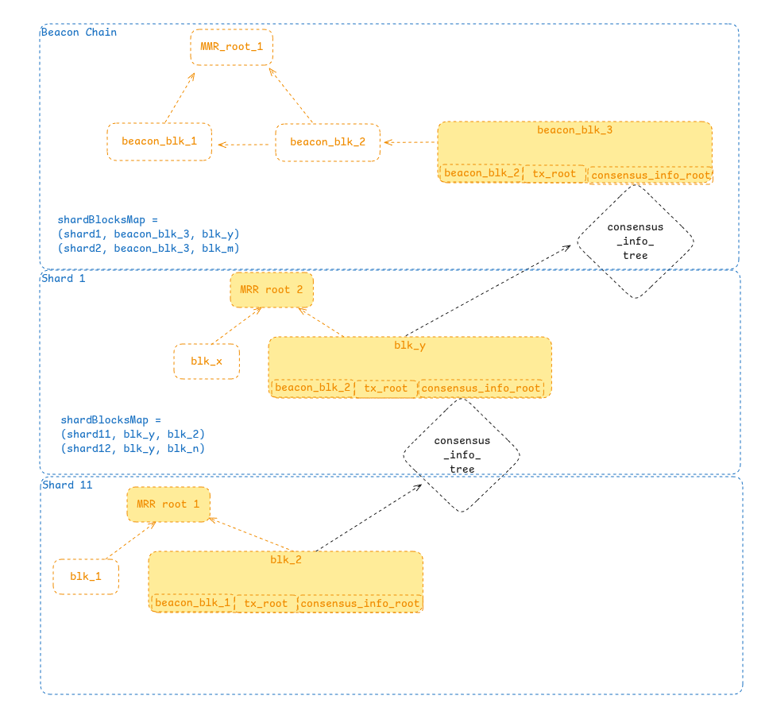

## Shard blocks commitment and proof generation.

The goal of this PR is to surface the core data structures and mechanics of the process of
committing and verifying the history of a child shard to the upper levels of the hierarchy.

_NOTE: This PR is for discussion purposes only and I don't expect it to be merged as is. Eventually
this will become part of the implementation and/or the final spec._

### Submitting blocks to the parent

1. Assume the following information (at least) in the `BlockHeader` of a shard block. The fields
   included from the canonical block structure from any other blockchain are:
   - A reference to the latest final block seen by the farmer in the beacon chain when proposing
     this block.
   - The root hash of all the blocks and segments from the child shard being submitted to the upper
     layers in this block (more about this in the sections below).
   - The root hash of the state of the child shard after applying the transactions in this block.
   - Raw consensus information that needs to be included in a block to submitted to the upper layers
     (e.g. `SegmentDescription`)
   - The root hash of the Mountain Merkle Tree (MMR) of the history of the shard after appending the
     parent block.

```rust
struct BlockHeader<T: SegmentDescription>
	/// Block number
	number: BlockNumber
	/// State root (can be considered redundant if tx_root is included)
	state_root: Hash
	/// Root of the Merkle tree of transactions included in the block.
	tx_root: Hash
	/// Block solution.
	solution: Proof
	/// Block number and hash of the beacon block referenced by this hash block.
	beacon_chain_ref: (BlockNumber, Hash)
	// The commitment of consensus information for a shard is not stored as
	// plain transactions in the block, but as their raw data structures (mainly block
	// and segment information from the child shard).
	consensus_info_root: Hash
	/// List of segments and consensus objects that need to be submitted to the upper
	/// layers of the chain.
	consensus_info: Vec<T>
	/// Hash of the parent block.
	parent_hash: Hash
	/// Pointer to the MMR root of the history of the shard after appending the parent block.
	/// This interconnects the root of the history for the child shard after every block,
	/// allowing to easily generate proofs for the history of the shard.
	parent_mmr_history_root: Hash
}
```

2. Fields in the `BlockHeader` can be arranged in a Merkle Tree to compute the hash of the block as
   the Merkle proof of this tree instead of directly hashing the whole header. This has an
   interesting consequences, as it would allow to generate proofs for specific elements of the block
   header without requiring the whole header.

> Appendix: It is worth structuring the block header as a Merkle tree to generate proofs for
> specific header fields like `tx_root`, `state_root` `parent_mmr_history_root` and
> `consensus_info_root` are already represented as root references to the underlying data structured
> as a tree? A proof for some field in the block header will be of `log_2(num_fields_in_header)` *
> hash_length`. The savings of hashing the whole header instead of using a tree and having to provide all the fields in the header to verify the block can be computed as `(total_block_header_size-log_2(num_fields_in_header)*hash_length)/total_block_header_size`.
> If this savings are worth the computational overhead of having to compute the Merkle tree, then we
> should consider using trees for headers.

3. Farmers submit in a transaction the `BlockHeader` for new blocks to the parent chain. Blocks are
   only accepted if:

   - References a valid beacon chain block.
   - The solution is within the right solution range.
   - It has an increasing block number (unless a fork has happened and can be clearly identified).
     If the block number of the block being submitted is not the next immediate one and is lower
     than the latest committed in the parent, it means that a reorg has happened, and the parent
     chain needs to also reorg its own view of the child shard's history.
   - It points to the right parent block, meaning the latest committed block in the parent chain
     points to the most recently submitted block in the child shard (and with the block number
     immediately below).
   - The result of the validation notifies the parent chain if the validated block can be appended
     to the child shard history or if a reorg is required, and its view of the child shard history
     needs to be adjusted accordingly.

```rust

/// Enum to represent the validation result of a block submission.
enum ValidationResult {
	Valid,
	ReOrg,
}

/// Validates the submitted block header against the following conditions and determines
/// whether the block can be appended to the child shard history or if a reorg is required.
fn validate_block_submission(block_header: &BlockHeader, parent_chain: &ParentChain) -> Result<ValidationResult, Error> {
	// 1. Check if the block references a valid beacon chain block.
	if !beacon_chain.is_valid_block(block_header.beacon_chain_ref) {
		return Err(Error::InvalidBeaconChainReference);
	}

	// 2. Verify that the solution is within the acceptable range.
	if !is_solution_in_range(block_header.solution) {
		return Err(Error::InvalidSolutionRange);
	}

	// 3. Ensure the block number is increasing or handle reorg scenarios.
	let latest_committed_block = parent_chain.get_latest_committed_block(block_header.shard_id);
	if block_header.number <= latest_committed_block.number {
		if is_reorg_valid(block_header, latest_committed_block) {
			return Ok(ValidationResult::ReOrg);
		} else {
			return Err(Error::InvalidBlockNumberOrReorg);
		}
	} else if block_header.number != latest_committed_block.number + 1 {
		return Err(Error::NonSequentialBlockNumber);
	}

	// 4. Verify that the block points to the correct parent block.
	let expected_parent_hash = latest_committed_block.hash;
	if block_header.parent_hash != expected_parent_hash {
		if is_reorg_valid(block_header, latest_committed_block) {
			return Ok(ValidationResult::ReOrg);
		} else {
			return Err(Error::InvalidParentBlockReference);
		}
	}

	Ok(ValidationResult::Valid)
}

/// Helper function to check if a reorg is valid.
fn is_reorg_valid(block_header: &BlockHeader, latest_committed_block: &BlockHeader) -> bool {
	// Check if the block number is lower than the latest committed block
	// and if the parent chain's view of the child shard's history aligns with the reorg.
	let parent_view = parent_chain.get_child_shard_history(block_header.shard_id);
	parent_view.is_consistent_with_reorg(block_header)
}

/// Helper function to check if the solution is within the valid range.
fn is_solution_in_range(solution: &Proof) -> bool {
	// Current logic for solution verification
	// NOTE: (it may change slightly in the future once we define better how sharded farming will work)
	true
}
```

4. If the verification is successful, the following information is stored in the parent shard for
   each shard. This information can be used to generate inclusion proofs for the blocks in the child
   shard and compare the with the information submitted in the parent chain.

```rust
/// Data structure that is kept on-chain with the hash of the block submitted from the child shard.
let shardBlocksMap = HashMap<ShardId, HashMap<BlockNumber, Hash>>
```

5. Full nodes in child shards represent their own history as Mountain Merkle Roots (MMRs) whose root
   is included as a field in every block, allowing them to include in every block a view of their
   history that would allow for the generation of proofs of their history without having to wait for
   their segments to be included in the global history in the beacon chain.

6. The protocol is recursive, so immediate children from the beacon chain are also submitting their
   blocks to the beacon chain, and the beacon chain itself keeps a view of its child shards.

### Generating block proofs.

To better understand the recursive nature of the data structures and proofs, we can visualise the
system as a tree of trees, where each level represents a shard, and the beacon chain is the root.
Below is a conceptual breakdown of the data structures and their relationships, followed by a
recursive proof structure.

#### Recursive Data Structure Visualization

1. **Beacon Chain**: The root of the hierarchy, containing references to its child shards inside its
   `shardBlocksMap`.
2. **Shard Levels**: Each shard contains its own blocks, which are referenced by their parent
   shard's blocks, and keep pointers to its own children, forming a recursive structure.

#### Data Structures

```rust
/// Represents a proof that a block is part of the global history.
struct BlockInclusionProof {
	/// Recursive proofs for each level of the shard hierarchy.
	recursive_proofs: Vec<BlockInclusionProofLevel>,
}

/// Represents a single level of the inclusion proof.
struct BlockInclusionProofLevel {
	/// ShardID of the current shard the proof belongs to.
	shard_id: ShardId,
	/// Merkle proof for the block in the current shard.
	shard_proof: Vec<Hash>,
	/// Block inclusion proof for the inclusion of the child block into the consensus_info
	/// of the parent chain.
	child_block_proof: Option<Vec<Hash>>,
	/// Parent block number where the shard block was committed.
	parent_block_number: BlockNumber,
}
```

#### Recursive Proof Generation

The proof generation starts from the lowest shard and works its way up to the beacon chain. Let's
assume that we want to generate a proof for a block, `blk_2` in `shard_11`:

- We first request to `shard_11` the proof that `blk_2` is part of the history of `shard_11`. This
  proof can be generated by any honest node in the shard that is following the history of the shard,
  and will be generated by providing the MMR path proof for the block in the shard, and the block
  number of the parent block that included the submission of `blk_2` to the parent chain.
- `blk_2` was submitted to its parent `shard_1` and included in `blk_y` of `shard_1`. To complement
  the proof, we need to provide a Merkle proof for the transaction in `blk_y` that committed the
  block `blk_2` in the parent chain belongs to the history of its parent (the beacon chain). This
  proof can be generated by any honest node in `shard_1` that is following the history of the shard,
  and will be generated by providing the MMR path proof for the transaction in `blk_y` that
  committed `blk_2` (in the same way its was done for `shard11`).
- Additionally, a proof needs to be generated that indeed, `blk_3` is included in `blk_y` by
  providing the `BlockHeader` Merkle proof that `blk_3` is included in the `consensus_info` of
  `blk_y` and is consistent with `consensus_info_root`
- With these `BlockInclusionProof` for the two levels, we prove the whole path of inclusion of the
  block from the child shard to the beacon chain.

```rust
/// Generates a recursive proof that a block is part of the global history.
fn generate_recursive_proof<T: BlockId>(
	shard_id: ShardId,
	block_id: T,
) -> Result<BlockInclusionProof, Error> {
	let mut proofs = Vec::new();
	let mut current_shard_id = shard_id;
	let mut current_block_id = block_id;

	// Traverse up the shard hierarchy to generate proofs for each level.
	while let Some((parent_block_number, shard_mmr_proof)) = get_parent_block_and_mmr_proof(current_shard_id, current_block_id)? {
		// Generate child block proof if the current shard has children.
		let child_block_proof = if has_child_shards(current_shard_id) {
			Some(generate_child_block_proof(current_shard_id, current_block_id)?)
		} else {
			None
		};

		// Add the proof for the current level.
		proofs.push(BlockInclusionProofLevel {
			shard_id: current_shard_id,
			shard_proof: shard_mmr_proof,
			child_block_proof,
			parent_block_number,
		});

		// Move to the parent shard for the next iteration.
		current_shard_id = get_parent_shard_id(current_shard_id)?;
		current_block_id = parent_block_number;
	}

	Ok(BlockInclusionProof { recursive_proofs: proofs })
}

/// Generates a proof for a child block being included in the current shard.
fn generate_child_block_proof<T: BlockId>(
	shard_id: ShardId,
	block_id: T,
) -> Result<Vec<Hash>, Error> {
	// Retrieve the Merkle proof for the child block's inclusion in the current shard.
	get_child_block_merkle_proof(shard_id, block_id)
}
```

#### Recursive Proof Verification

The verification process ensures that each level of the proof is valid and consistent with the
global history. To verify the proof, we need to perform the following steps:

- Given a `BlockInclusionProof`, we start from the highest level and work our way down to the lowest
  shard.
- We first verify that the `mrr_proof` for `blk_y` in `shard1` is consistent with the block header
  hash committed in the beacon chain.
- If the check is successful we verify the `shard_proof` for `blk_2` in `shard11` is consistent with
  the block header hash.
- Finally, we verify that the `blk_2` is included in the `consensus_info` of `blk_y` by checking the
  `child_block_proof` against the `consensus_info_root` of `blk_y`.
- If all checks are successful, we can conclude that `blk_2` is part of the global history.
- Optionally, proofs that the beacon chain block referenced from these blocks is part of the global
  history can be included in the proof, but this is not strictly necessary as all nodes are
  following the beacon chain.

```rust
/// Verifies a recursive proof that a block is part of the global history.
fn verify_recursive_proof(
	block: Block,
	proof: BlockInclusionProof,
	recent_beacon_hashes: &[Hash], // Access to the history of the beacon chain.
) -> Result<(), Error> {
	let mut current_block = block;

	for level in proof.recursive_proofs.iter() {
		// Verify that the shard proof is consistent with the block header hash.
		if !verify_merkle_proof(&level.shard_proof, &current_block.header.hash()) {
			return Err(Error::InvalidShardProof);
		}

		// Verify that the child block proof is consistent with the consensus_info_root of the parent block.
		if let Some(child_block_proof) = &level.child_block_proof {
			let parent_block = get_block_by_number(level.parent_block_number)?;
			if !verify_merkle_proof(child_block_proof, &parent_block.header.consensus_info_root) {
				return Err(Error::InvalidChildBlockProof);
			}
			current_block = parent_block;
		} else {
			// If no child block proof exists, move to the parent block.
			current_block = get_block_by_number(level.parent_block_number)?;
		}
	}

	// Verify that the final parent block is part of the beacon chain.
	if !recent_beacon_hashes.contains(&current_block.header.hash()) {
		return Err(Error::InvalidBeaconChainReference);
	}

	Ok(())
}
```

The following diagram illustrates the recursive proof structure:

