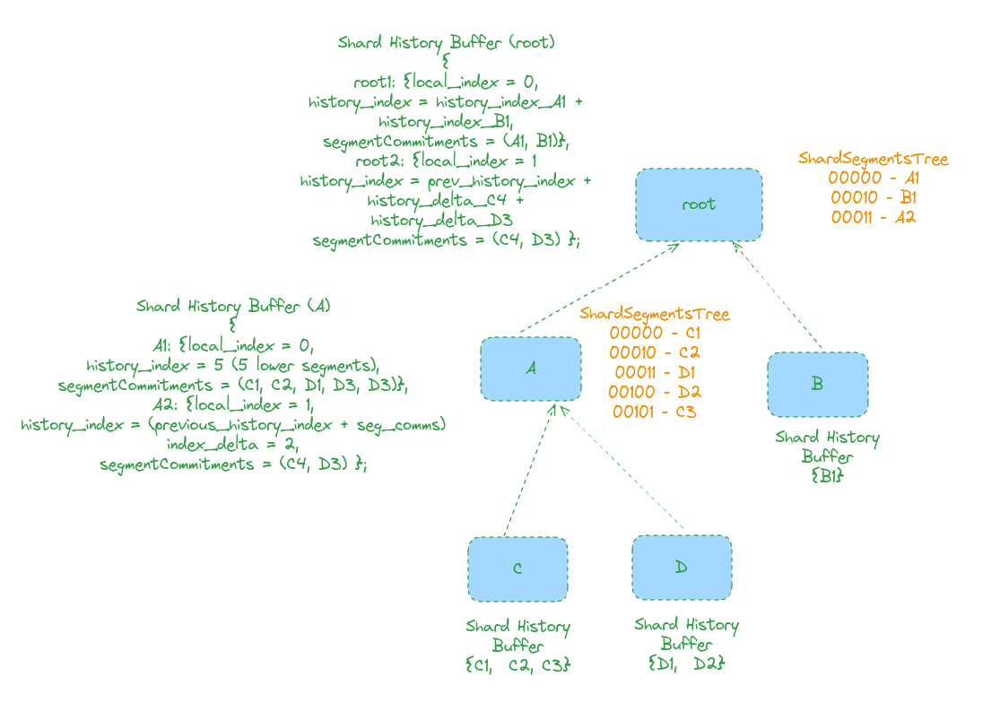

This week I've gone a bit deeper into the design of the multi-shard Subspace protocol idea which I briefly introduced in my last update. The protocol is conformed by the following parts:
* Sharded archiving, responsible for creating a global canonical history of the whole system, and of creating the history records that will eventually become part of farmers' plots.
* Sharded plotting, which takes records from the global history and seals them in plots that include segments of the history of every shard of the system, and that will be used for the farming process.
* And finally, merged farming, which is the protocol responsible for challenging farmer plots, and deriving the corresponding winning tickets that elect block proposers in specific shards.

Let me introduce the high-level operation behind each of these sub-protocols, while digging deep in the one that I've focused the most on this week: sharded archiving.

<!--more-->

## Adding the pieces together
High-level, this is how I am imagining each of these sub-protocols working together:
- Farmers self-assign themselves to whatever shards they want to farm and participate in. At this point, this is a free choice, but we will build the rewards and incentive model in a way where rational farmers will prioritise farming on shards that have less competition, thus balancing the power in the system among all shards.
- Farmers in every shard, independently, build the history buffer for the shard with new segments as new blocks are created and considered final in the shard.
- As new segments are created in a shard, their segment commitments (along with some extra metadata useful for verification) are committed to the shard's parent so they are propagated up the hierarchy to the root (beacon chain) where the global history of the system is constructed. This history buffer in the beacon chain includes information about all segments in all shards (we will discuss briefly how this can be done in the next few sections).
- The way in which farmers assign themselves, i.e. show interest in participating in a shard, is by committing storage in a specific shard. So in the multi-shard version of the Subspace protocol, space is assigned exclusively to a shard, and plotting is performed in a way where sectors need to be explicitly linked to a shard.
- For plotting, the selection of pieces for a plot is performed globally by selecting pieces from any shard available in the global history at the beacon chain. All plots are built with pieces from all shards, and the selection of pieces is done in a way that is proportional to the amount of space assigned to each shard. So we see that plotting relies on the construction of this global history in the root of the hierarchy for its operation, but the overall mechanism is still the same as in the single-shard Subspace protocol.
- Finally, farming is done similarly to how is done in single-chain Subspace protocol, but with the difference that winning tickets of a plot belong exclusively to the shard where that plot is committed. I will start sharing more details on how this is done in the next few weeks, but the idea is that shards' difficulty, and thus their solution range, are independent and dynamically adjusted according to the storage committed in the shard and their historical block generation rate. 
  - Even more, we are thinking of a way to allow farmers to "merge" their plots across shards, so they can farm in multiple shards at the same time when the power in a shard is low. For this, we expect plots to be primarily committed to a specific shard, and be assigned to a set of fallback (secondary) shards so when something bad happens in one of these secondary shards, or the storage (and thus the block farmers will be allowed to generation rate) falls, farmers secondarily assigned to these shards are allowed to draw winning tickets and vote (or propose) blocks in these shards.

## Sharded Archiving
The operation of sharded archiving is quite straightforward, nodes in a shard are creating segments of their history that need to be submitted to the beacon chain to make them part of the global history of the system. The first question that we may ask ourselves is: can we have all shards committing segments commitments (or headers) directly into the beacon chain as soon as they are created?

### Can we commit all segment headers to the beacon chain?
Let's a assume we have in the order of 1M shards in the system with:
- `RECORDED_HISTORY_SEGMENT_SIZE = 128MiB`
- `WITNESS_SIZE = 48B`
- `COMMITMENT_SIZE = 48B`
- `BLOCK_SIZE = 4MB`
- `BLOCK_TIME = 6s`

This translates into:
- `BLOCKS_PER_SEGMENT = SEGMENT_SIZE / BLOCK_SIZE = 32`
- `SEGMENT_GENERATION_TIME_SHARD= (BLOCK_TIME * 32) = 192 seconds`
- `SEGMENT_RATE_PER_SLOT = 0.03`

Assuming the `SegmentHeader` with the following struct being committed to the beacon chain:
```
V0 {
    /// ShardID
    shard_id: ShardID, (20bits ~ 4Bytes)
    /// Segment index
    segment_index: SegmentIndex, (8 Bytes)
    /// Root of commitments of all records in a segment.
    segment_commitment: SegmentCommitment, (48 Bytes)
    /// Hash of the segment header of the previous segment
    prev_segment_header_hash: Blake3Hash, (32 Bytes)
    /// Last archived block
    last_archived_block: LastArchivedBlock (8 Bytes), 
}
```
So if we commit each `SegmentHeader` we will be committing `100 bytes` per segment (committing the segment header is the worst case scenario, we could optimise this and make it more compact by just committing the segment commitment with some additional metadata, but let's consider the worst case scenario for this exercise). 

If we get all shards committing their segment headers to the beacon chain directly instead of letting segment commitments flow up through the hierarchy, this means:
- `AVG_SEGMENTS_PER_SLOT_IN_BEACON = NUM_SHARDS * 0.03 = 30k SEGMENTS / SLOT`
- `BYTES_COMMITTED_PER_SLOT_IN_BEACON = AVG_SEGMENTS_PER_SLOT_IN_BEACON * SEGMENT_HEADER_SIZE = 30 * 100 KBYTES = ~3MB`

With 4MiB blocks, committing all segments into the beacon chain could actually fit a single block of the beacon chain with the current rate being considered.

The number of lower level shards that can be supported by a parent network (and thus the beacon chain) with 4MiB blocks would be:
`NUM_SHARDS = BLOCK_SIZE / (SEGMENT_RATE_PER_SLOT * SEGMENT_HEADER_SIZE) = 4 / (0.03 * 100) = ~1.3M Shards `

This is great! It means that with a beacon chain and a single level of shards below committing their segments directly as soon as they are created we could get to  the order of 1M independent shards.

### But what if we use larger proofs?
The back-of-the-envelope calculation above assumes 48B commitments for segments, but what if we want to use a type of vector commitment for segments that is not KZG and requires bigger proofs? Then we may not be able to commit every proof, and we may need to rely on several layers of shards forming a hierarchy where parents aggregate segments to propagate them up and commit them to the global history. On top of this, we also may want to aggregate commitments from lower levels to minimise the state growth in the beacon chain, but this is a secondary concern at this point.

I actually explored several solutions for this throughout the week:
- The first one is a bit complex and may have been an overkill in hindsight (thank you Nazar for pointing this out). I won't jump into the nitty gritty details and will leave this image explaining the high-level here for reference. The idea was for every parent shard to build a tree with all the segments from their children. With every new segment created in the parent chain an updated commitment for the tree of children segments is attached to the parent shard segment along with proofs for all the new segments included in the tree since the last update. In this way, parent chain segments implicitly propagate relevant information about their children to their upper layers (and eventually the beacon chain).

<p align="center">
</img>
</p>

- Nazar rightly pointed out the following: _why wait for parent chain segment generation as the cut-off point for committing segments? Why not batch whatever segments from the children have been submitted to a shard to propagate them to upper layers as soon as they have been included in a block?_ And this is the solution that I will consider for the design. The process is as follows:
- Let's take as an example the tree of shards from the figure above. Shards C and D are generating new segments and submitting their commitments (or segment headers) to their parent, A.
- These segments are submitted to A by nodes from C and D as transactions that will be included in a block of A.
- As soon as A verifies a block including transactions with segments from C and D, nodes in A will create a "super segment" commitment (this is how we are going to call this data structure), that creates a commitment for all the segments included in the block of A. 
- Nodes in A will be periodically creating their own segments and committing them to the beacon chain, as well as the super segment commitment for the segments from C and D triggered through the submission of segments in A.
- The super segment commitment will be a vector commitment that proves the commitment of segments in the history of A, and are used to include segments from deeper layer in batch into the global history kept in the beacon chain. Super segments will be sequenced along with regular segments from immediate children of the beacon chain conforming the global history of the system with all of the segments created in all shards.

As a reference for folks with deep knowledge of the implementation of the Subspace protocol, the idea is to get a lot of inspiration to how incremental archiving currently works for the aggregation and submission of segment commitments into upper layers of the hierarchy.

## What's next?
For next week I am hoping to get a first draft of the spec for sharded archiving with more lower level details of how it works (and how I imagine the implementation to be). It may be a stretch, but I am also hoping to have a good picture of how sharded plotting will look like.

One of the early mandates that I got from Nazar when I started was to identify any potential reasons why a system like this may not be feasible or may not reach the scale that we are aiming for, and so far I haven't found any, which is exciting! That being said, please reach out if you see any potential flaws on my reasoning.

Hope to see you all in the next update!